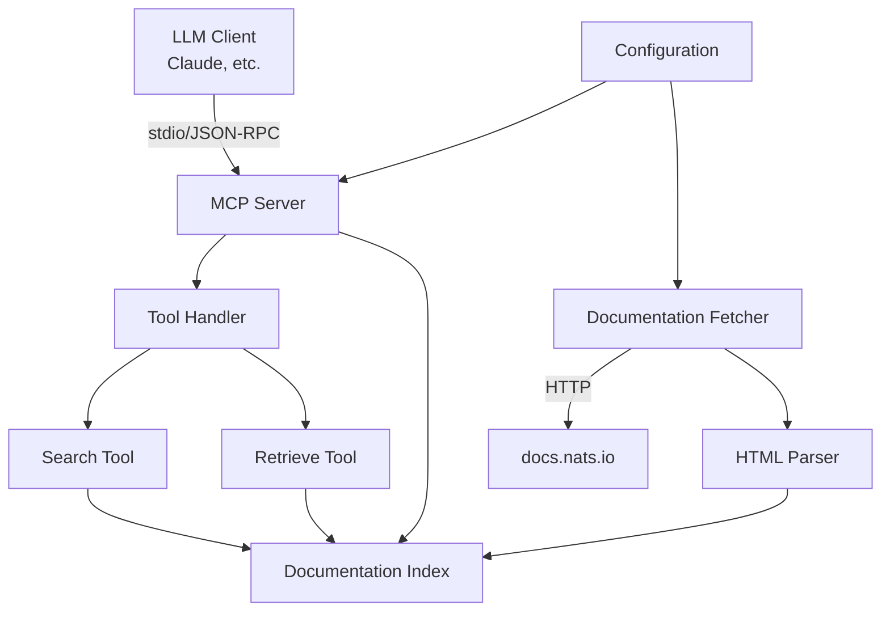

# Design Document: NATS Documentation MCP Server

## Overview

The NATS Documentation MCP Server is a Go-based implementation of the Model Context Protocol that provides LLMs with programmatic access to NATS documentation. The server exposes MCP tools for searching and retrieving documentation content from https://docs.nats.io/, enabling AI assistants to provide accurate, up-to-date information about NATS.

The implementation leverages the [mark3labs/mcp-go](https://github.com/mark3labs/mcp-go) SDK for MCP protocol handling, uses stdio transport for client communication, and includes automated build/release infrastructure via GoReleaser and GitHub Actions.

**Key Design Principles:**
- Single binary distribution with no external dependencies
- Fast, in-memory documentation indexing for quick searches
- MCP protocol compliance for broad LLM client compatibility
- Cross-platform support (Linux, macOS, Windows on AMD64 and ARM64)
- Automated release pipeline for consistent versioning

## Architecture

### System Components



### Component Responsibilities

**MCP Server Core:**
- Implements MCP protocol using mcp-go SDK
- Handles JSON-RPC 2.0 communication over stdio transport
- Manages tool registration and invocation
- Coordinates initialization and shutdown sequences

**Documentation Fetcher:**
- Fetches documentation pages from docs.nats.io via HTTP
- Discovers documentation structure through sitemap or crawling
- Handles rate limiting and retries with exponential backoff
- Caches fetched content to minimize network requests

**HTML Parser:**
- Extracts structured content from HTML documentation pages
- Identifies section titles, headings, code blocks, and body text
- Preserves formatting for code examples and lists
- Generates searchable text representations

**Documentation Index:**
- In-memory data structure for fast lookups
- Supports full-text search with relevance ranking
- Maps documentation paths to content
- Provides metadata (titles, URLs, sections)
- Caches all fetched documentation for the session duration
- No persistence between sessions (ensures fresh documentation)

**Tool Handlers:**
- Search Tool: Accepts queries, searches index, returns ranked results
- Retrieve Tool: Accepts doc IDs/paths, returns full content

**Configuration Manager:**
- Loads settings from config file or environment variables
- Provides defaults for all optional parameters
- Validates configuration on startup

## Components and Interfaces

### MCP Server Interface

```go
// Server represents the MCP server instance
type Server struct {
    config *Config
    index  *DocumentationIndex
    logger *Logger
}

// Start initializes and runs the MCP server
func (s *Server) Start(ctx context.Context) error

// RegisterTools registers all available MCP tools
func (s *Server) RegisterTools() error

// Shutdown gracefully stops the server
func (s *Server) Shutdown(ctx context.Context) error
```

### Documentation Index Interface

```go
// DocumentationIndex stores and searches documentation content
type DocumentationIndex struct {
    documents map[string]*Document
    searchIndex *SearchIndex
}

// Document represents a single documentation page
type Document struct {
    ID          string
    Title       string
    URL         string
    Content     string
    Sections    []Section
    LastUpdated time.Time
}

// Section represents a subsection within a document
type Section struct {
    Heading string
    Content string
    Level   int
}

// Search performs full-text search and returns ranked results
func (idx *DocumentationIndex) Search(query string, limit int) ([]SearchResult, error)

// Get retrieves a document by ID or path
func (idx *DocumentationIndex) Get(id string) (*Document, error)

// Index adds or updates a document in the index
func (idx *DocumentationIndex) Index(doc *Document) error
```

### Search Result Structure

```go
// SearchResult represents a single search result
type SearchResult struct {
    DocumentID  string
    Title       string
    URL         string
    Summary     string
    Relevance   float64
    MatchedText string
}
```

### Tool Definitions

**Search Tool:**
```go
Tool{
    Name: "search_nats_docs",
    Description: "Search NATS documentation by keywords or topics. Returns relevant documentation sections with summaries.",
    InputSchema: {
        Type: "object",
        Properties: {
            "query": {
                Type: "string",
                Description: "Search query (keywords or topic)",
            },
            "limit": {
                Type: "integer",
                Description: "Maximum number of results (default: 10)",
                Default: 10,
            },
        },
        Required: ["query"],
    },
}
```

**Retrieve Tool:**
```go
Tool{
    Name: "retrieve_nats_doc",
    Description: "Retrieve complete content of a specific NATS documentation page by ID or URL path.",
    InputSchema: {
        Type: "object",
        Properties: {
            "doc_id": {
                Type: "string",
                Description: "Document ID or URL path (e.g., 'nats-concepts/overview')",
            },
        },
        Required: ["doc_id"],
    },
}
```

### Configuration Structure

```go
// Config holds server configuration
type Config struct {
    // Server settings
    LogLevel string `env:"LOG_LEVEL" default:"info"`
    
    // Documentation settings
    DocsBaseURL     string `env:"DOCS_BASE_URL" default:"https://docs.nats.io"`
    FetchTimeout    int    `env:"FETCH_TIMEOUT" default:"30"`
    MaxConcurrent   int    `env:"MAX_CONCURRENT_FETCHES" default:"5"`
    
    // Search settings
    MaxSearchResults int `env:"MAX_SEARCH_RESULTS" default:"50"`
}
```

**Note:** Documentation is cached in memory for the session duration. No disk caching is used to ensure fresh documentation on each server start.

## Data Models

### Document Storage Model

Documents are stored in memory with the following structure:

```go
type DocumentStore struct {
    // Primary storage: map of document ID to document
    documents map[string]*Document
    
    // Inverted index: map of terms to document IDs
    invertedIndex map[string][]string
    
    // Document metadata for quick lookups
    metadata map[string]*DocumentMetadata
}

type DocumentMetadata struct {
    ID          string
    Title       string
    URL         string
    WordCount   int
    LastIndexed time.Time
}
```

### Search Index Model

The search index uses TF-IDF (Term Frequency-Inverse Document Frequency) for relevance ranking:

```go
type SearchIndex struct {
    // Term frequencies per document
    termFrequency map[string]map[string]int
    
    // Document frequencies per term
    documentFrequency map[string]int
    
    // Total number of documents
    totalDocuments int
}

// CalculateRelevance computes TF-IDF score for a query
func (si *SearchIndex) CalculateRelevance(query string, docID string) float64
```

### Documentation Fetching Model

```go
type DocumentationFetcher struct {
    client      *http.Client
    baseURL     string
    rateLimiter *rate.Limiter
    cache       *Cache
}

// FetchAll discovers and fetches all documentation pages
func (df *DocumentationFetcher) FetchAll(ctx context.Context) ([]*Document, error)

// FetchPage fetches a single documentation page
func (df *DocumentationFetcher) FetchPage(ctx context.Context, path string) (*Document, error)
```

## Correctness Properties

*A property is a characteristic or behavior that should hold true across all valid executions of a system—essentially, a formal statement about what the system should do. Properties serve as the bridge between human-readable specifications and machine-verifiable correctness guarantees.*


### Property 1: Concurrent Client Handling

*For any* set of concurrent client connections, the server should handle all connections without errors, and when any client disconnects, resources should be cleaned up without affecting other clients.

**Validates: Requirements 1.4, 1.5**

### Property 2: Search Result Completeness

*For any* search query that returns results, each result should contain a title, summary, and URL, and results should be ordered by descending relevance score.

**Validates: Requirements 2.2, 2.3**

### Property 3: Case-Insensitive Search

*For any* search query string, changing the case of the query should return the same set of documents (though possibly in different order if relevance scores differ).

**Validates: Requirements 2.5**

### Property 4: Valid Document Retrieval

*For any* document ID that exists in the index, retrieving that document should return non-empty content with title, URL, and preserved formatting.

**Validates: Requirements 3.2, 3.4, 3.5**

### Property 5: Invalid Document Error Handling

*For any* document ID that does not exist in the index, retrieval should return a structured error indicating the document was not found.

**Validates: Requirements 3.3**

### Property 6: Indexed Documents Are Searchable

*For any* document that has been indexed, searching for terms from its title or content should return that document in the results.

**Validates: Requirements 4.2**

### Property 7: Document Parsing Completeness

*For any* HTML document that is parsed and indexed, the indexed version should contain the document's title, headings, and main content sections.

**Validates: Requirements 4.3**

### Property 8: Retry Backoff Behavior

*For any* sequence of failed fetch attempts, the delay between retries should increase exponentially (each retry delay should be greater than the previous).

**Validates: Requirements 4.5**

### Property 9: Configuration Loading

*For any* valid configuration parameter provided via command-line flag, environment variable, or config file, the server should load and use that value, with config file taking precedence over environment variables.

**Validates: Requirements 8.1, 8.2, 8.3, 5.5**

### Property 10: Configuration Validation

*For any* invalid configuration value (e.g., negative timeout, invalid log level), the server should report a validation error during startup and not proceed with invalid configuration.

**Validates: Requirements 8.4**

### Property 11: Configuration Defaults

*For any* optional configuration parameter that is not provided, the server should use a documented default value.

**Validates: Requirements 8.5**

### Property 12: Log Level Configuration

*For any* valid log level value (debug, info, warn, error), setting that log level should be accepted and applied to the logger.

**Validates: Requirements 9.2**

### Property 13: Tool Error Response Structure

*For any* tool invocation that fails (invalid input, internal error, etc.), the response should be a structured error with an error message and error code.

**Validates: Requirements 9.3**

## Error Handling

### Error Categories

**Network Errors:**
- HTTP request failures when fetching documentation
- Timeout errors during documentation fetching
- DNS resolution failures

**Handling Strategy:**
- Retry with exponential backoff (initial delay: 1s, max delay: 60s, max retries: 5)
- Log each retry attempt with context
- Return error to caller after max retries exceeded

**Parsing Errors:**
- Malformed HTML that cannot be parsed
- Missing expected HTML elements
- Invalid character encoding

**Handling Strategy:**
- Log parsing error with document URL
- Skip the problematic document
- Continue processing other documents
- Track failed documents for reporting

**MCP Protocol Errors:**
- Invalid JSON-RPC requests
- Unknown tool names
- Missing required parameters
- Invalid parameter types

**Handling Strategy:**
- Return JSON-RPC error response with appropriate error code
- Include descriptive error message
- Log the error for debugging
- Do not crash the server

**Search/Retrieval Errors:**
- Document not found
- Empty search query
- Invalid document ID format

**Handling Strategy:**
- Return structured error response to client
- Include helpful error message
- Log the error with context
- Suggest corrections when possible (e.g., "Did you mean...")

**Configuration Errors:**
- Invalid configuration file format
- Missing required configuration
- Invalid configuration values

**Handling Strategy:**
- Validate all configuration on startup
- Report all validation errors at once
- Exit with non-zero status code
- Provide clear error messages with examples

**Resource Errors:**
- Out of memory
- Disk space exhausted (if caching)
- File permission errors

**Handling Strategy:**
- Log critical error with full context
- Attempt graceful shutdown
- Clean up resources
- Exit with appropriate error code

### Error Response Format

All tool errors follow this structure:

```go
type ToolError struct {
    Code    string `json:"code"`
    Message string `json:"message"`
    Details map[string]interface{} `json:"details,omitempty"`
}
```

Error codes:
- `DOCUMENT_NOT_FOUND`: Requested document does not exist
- `INVALID_QUERY`: Search query is invalid or empty
- `INVALID_PARAMETER`: Tool parameter is invalid
- `INTERNAL_ERROR`: Unexpected internal error
- `FETCH_ERROR`: Failed to fetch documentation
- `PARSE_ERROR`: Failed to parse documentation

## Testing Strategy

### Dual Testing Approach

The testing strategy employs both unit tests and property-based tests to ensure comprehensive coverage:

**Unit Tests:**
- Specific examples demonstrating correct behavior
- Edge cases (empty queries, missing documents, malformed HTML)
- Integration points between components
- Error conditions and error response formats
- Startup and shutdown sequences
- Configuration loading from different sources

**Property-Based Tests:**
- Universal properties that hold for all inputs
- Comprehensive input coverage through randomization
- Minimum 100 iterations per property test
- Each property test references its design document property

### Property-Based Testing Configuration

**Library:** Use [leanovate/gopter](https://github.com/leanovate/gopter) for Go property-based testing

**Test Configuration:**
- Minimum iterations: 100 per property test
- Each test tagged with: `Feature: nats-docs-mcp-server, Property {N}: {property_text}`
- Generators for: search queries, document IDs, configuration values, HTML documents

**Property Test Coverage:**
- Property 1: Concurrent client handling (generate random number of concurrent clients)
- Property 2: Search result completeness (generate random queries)
- Property 3: Case-insensitive search (generate queries with random case variations)
- Property 4: Valid document retrieval (generate random valid doc IDs)
- Property 5: Invalid document error handling (generate random invalid doc IDs)
- Property 6: Indexed documents are searchable (generate random documents, index them, search)
- Property 7: Document parsing completeness (generate random HTML documents)
- Property 8: Retry backoff behavior (generate random failure sequences)
- Property 9: Configuration loading (generate random config values)
- Property 10: Configuration validation (generate random invalid config values)
- Property 11: Configuration defaults (generate random subsets of config)
- Property 12: Log level configuration (generate random log levels)
- Property 13: Tool error response structure (generate random error conditions)

### Unit Test Coverage

**MCP Server Tests:**
- Server initialization and startup
- Tool registration
- Client connection handling
- Graceful shutdown

**Documentation Fetcher Tests:**
- Successful page fetch
- HTTP error handling
- Timeout handling
- Rate limiting

**HTML Parser Tests:**
- Parse valid HTML with various structures
- Handle malformed HTML
- Extract code blocks and lists
- Handle special characters

**Search Index Tests:**
- Index single document
- Search with single term
- Search with multiple terms
- Empty search results
- Relevance ranking examples

**Configuration Tests:**
- Load from config file
- Load from environment variables
- Load from command-line flags
- Precedence order
- Validation errors

### Integration Tests

**End-to-End Scenarios:**
- Start server, connect client, invoke search tool, verify results
- Start server, connect client, invoke retrieve tool, verify content
- Start server with invalid config, verify error and exit
- Start server, fetch documentation, verify indexing
- Multiple clients connecting and invoking tools concurrently

### Test Data

**Mock Documentation:**
- Create sample HTML pages mimicking docs.nats.io structure
- Include various content types: text, code blocks, lists, tables
- Include edge cases: empty pages, very long pages, special characters

**Test Fixtures:**
- Sample configuration files (valid and invalid)
- Sample MCP requests (valid and invalid)
- Sample search queries (common and edge cases)

## Build and Release

### GoReleaser Configuration

The project uses GoReleaser for automated builds and releases. Key configuration:

```yaml
# .goreleaser.yaml
project_name: nats-docs-mcp-server

builds:
  - id: nats-docs-mcp-server
    binary: nats-docs-mcp-server
    main: ./cmd/server
    env:
      - CGO_ENABLED=0
    goos:
      - linux
      - darwin
      - windows
    goarch:
      - amd64
      - arm64
    ldflags:
      - -s -w
      - -X main.version={{.Version}}
      - -X main.commit={{.Commit}}
      - -X main.date={{.Date}}

archives:
  - id: default
    format: tar.gz
    format_overrides:
      - goos: windows
        format: zip
    files:
      - README.md
      - LICENSE
      - config.example.yaml

checksum:
  name_template: 'checksums.txt'

changelog:
  sort: asc
  filters:
    exclude:
      - '^docs:'
      - '^test:'
      - '^chore:'

release:
  github:
    owner: j4ng5y
    name: nats-docs-mcp-server
  draft: false
  prerelease: auto
```

### GitHub Actions Workflow

```yaml
# .github/workflows/release.yaml
name: Release

on:
  push:
    tags:
      - 'v*'

permissions:
  contents: write

jobs:
  goreleaser:
    runs-on: ubuntu-latest
    steps:
      - name: Checkout
        uses: actions/checkout@v4
        with:
          fetch-depth: 0

      - name: Set up Go
        uses: actions/setup-go@v5
        with:
          go-version: '1.22'

      - name: Run tests
        run: go test -v ./...

      - name: Run GoReleaser
        uses: goreleaser/goreleaser-action@v5
        with:
          distribution: goreleaser
          version: latest
          args: release --clean
        env:
          GITHUB_TOKEN: ${{ secrets.GITHUB_TOKEN }}
```

### Build Process

**IMPORTANT:** GoReleaser is the EXCLUSIVE tool for building binaries. Never use `go build` directly for production or development builds.

1. **Trigger:** Push a git tag matching `v*` pattern (e.g., `v1.0.0`)
2. **Checkout:** GitHub Actions checks out the repository with full history
3. **Setup:** Install Go 1.22
4. **Test:** Run all tests to ensure quality
5. **Build:** GoReleaser builds binaries for all platforms/architectures
6. **Archive:** Create compressed archives (tar.gz for Unix, zip for Windows)
7. **Checksum:** Generate SHA256 checksums for all artifacts
8. **Changelog:** Generate changelog from git commits
9. **Release:** Create GitHub release with all artifacts attached

**Development Builds:** Use `goreleaser build --snapshot --clean` for local testing.
**Release Testing:** Use `goreleaser release --snapshot --clean` to test the full release process locally.

### Version Management

- Use semantic versioning (MAJOR.MINOR.PATCH)
- Tag format: `vMAJOR.MINOR.PATCH` (e.g., `v1.0.0`)
- Pre-release tags: `vMAJOR.MINOR.PATCH-rc.N` (e.g., `v1.0.0-rc.1`)
- Version information embedded in binary via ldflags

### Distribution

**Release Artifacts:**
- `nats-docs-mcp-server_linux_amd64.tar.gz`
- `nats-docs-mcp-server_linux_arm64.tar.gz`
- `nats-docs-mcp-server_darwin_amd64.tar.gz`
- `nats-docs-mcp-server_darwin_arm64.tar.gz`
- `nats-docs-mcp-server_windows_amd64.zip`
- `nats-docs-mcp-server_windows_arm64.zip`
- `checksums.txt`

**Installation:**
1. Download appropriate archive for your platform
2. Verify checksum
3. Extract binary
4. Move to PATH location (e.g., `/usr/local/bin`)
5. Make executable (Unix systems)
6. Run with `nats-docs-mcp-server --help`

## Implementation Notes

### MCP SDK Usage

The implementation uses [mark3labs/mcp-go](https://github.com/mark3labs/mcp-go) SDK:

```go
import (
    "github.com/mark3labs/mcp-go/mcp"
    "github.com/mark3labs/mcp-go/server"
)

// Create server with stdio transport
s := server.NewMCPServer(
    "nats-docs-mcp-server",
    "1.0.0",
    server.WithStdioTransport(),
)

// Register tools
s.AddTool(searchTool, searchHandler)
s.AddTool(retrieveTool, retrieveHandler)

// Start server
err := s.Serve()
```

### Documentation Fetching Strategy

**Initial Approach:**
1. Fetch the main documentation page (https://docs.nats.io/)
2. Parse navigation/sidebar to discover all documentation pages
3. Fetch each page concurrently (with rate limiting)
4. Parse and index content

**Alternative Approach (if sitemap available):**
1. Fetch sitemap.xml
2. Extract all documentation URLs
3. Fetch pages concurrently
4. Parse and index content

**Caching Strategy:**
- **Session-based in-memory cache**: All fetched documentation is cached in memory for the duration of the server session
- **No persistence between sessions**: Cache is not written to disk, ensuring fresh documentation on each server start
- **Single fetch per session**: Documentation is fetched once at startup and reused for all subsequent requests
- **Cache key**: URL path
- **Benefits**: 
  - Zero network requests after initial fetch
  - Fast response times for all search and retrieval operations
  - Always fresh documentation (fetched at startup)
  - No stale data concerns (cache cleared on restart)
  - Simple implementation (no cache invalidation logic needed)

### Search Implementation

**Indexing:**
- Tokenize document content (split on whitespace and punctuation)
- Convert to lowercase for case-insensitive matching
- Build inverted index: term → list of document IDs
- Calculate term frequencies and document frequencies

**Searching:**
- Tokenize and lowercase query
- Look up each term in inverted index
- Calculate TF-IDF scores for matching documents
- Rank by score (descending)
- Return top N results with summaries

**Summary Generation:**
- Extract first 200 characters of content
- Or extract sentence containing query term
- Truncate at word boundary
- Add ellipsis if truncated

### Performance Considerations

**Memory Usage:**
- Full documentation stored in memory (~10-50 MB estimated)
- Inverted index adds ~20-30% overhead
- Total memory footprint: ~15-75 MB
- Acceptable for single-binary deployment
- All documentation cached in memory for session duration (no disk I/O after startup)
- Total memory footprint: ~15-75 MB
- Acceptable for single-binary deployment

**Startup Time:**
- Documentation fetching: 5-30 seconds (depending on network and doc size)
- Parsing and indexing: 1-5 seconds
- Total startup: 6-35 seconds
- Can be improved with caching

**Query Performance:**
- Search: O(terms * matching_docs) - typically <10ms
- Retrieval: O(1) hash lookup - typically <1ms
- Concurrent queries supported via goroutines

### Security Considerations

**Input Validation:**
- Sanitize all tool inputs
- Limit query length (max 500 characters)
- Validate document IDs (alphanumeric, hyphens, slashes only)
- Prevent path traversal attacks

**Network Security:**
- Use HTTPS for documentation fetching
- Validate TLS certificates
- Set reasonable timeouts
- Implement rate limiting

**Resource Limits:**
- Limit concurrent fetches (default: 5)
- Limit maximum document size (default: 10 MB)
- Limit search result count (default: 50)
- Prevent memory exhaustion

**Error Information:**
- Don't expose internal paths in errors
- Don't expose stack traces to clients
- Log sensitive errors server-side only
- Provide user-friendly error messages
