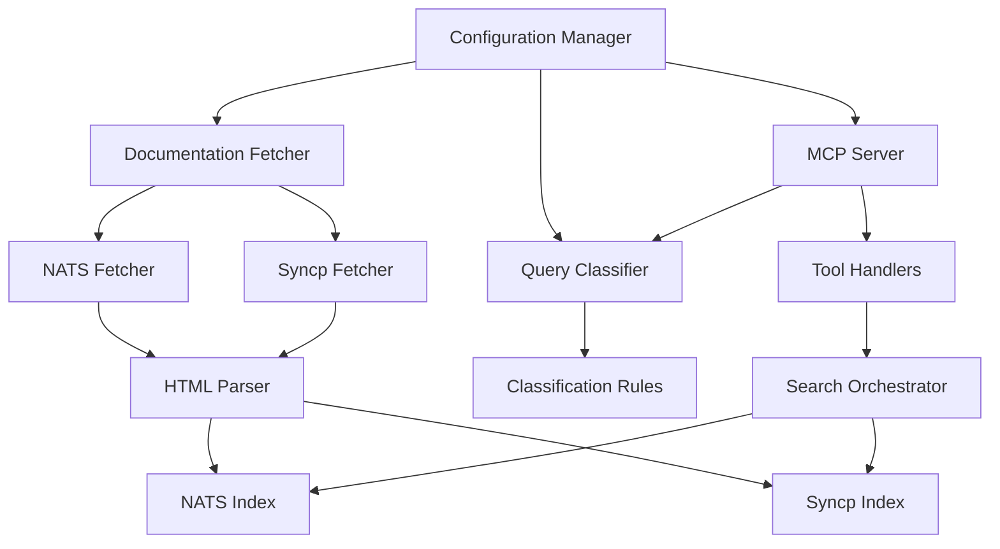

# Design Document: Syncp Documentation Support

## Overview

This design extends the NATS Documentation MCP Server to support dual documentation sources: the existing NATS documentation from docs.nats.io and the new Synadia Control Plane (syncp) documentation from docs.synadia.com/control-plane. The system will intelligently classify incoming queries to determine which documentation source(s) to search, maintaining backward compatibility while enabling syncp-specific queries.

The core innovation is a keyword-based query classifier that analyzes search terms to route queries to the appropriate documentation index. This approach is simple, fast, and requires no machine learning infrastructure while providing accurate classification for the well-defined domain of NATS vs syncp terminology.

**Key Design Decisions:**

1. **Dual Index Architecture**: Maintain separate TF-IDF indices for NATS and syncp documentation to enable independent querying and source attribution
2. **Keyword-Based Classification**: Use configurable keyword lists for classification rather than ML models, prioritizing simplicity and determinism
3. **Fallback to Both**: When classification is ambiguous, search both indices and merge results to ensure comprehensive coverage
4. **Backward Compatibility**: Preserve existing tool interfaces and default to NATS-only mode when syncp is not configured

## Architecture

### High-Level Component Diagram



### Data Flow

**Startup Flow:**
1. Configuration Manager loads config (including syncp URL and classification keywords)
2. Documentation Fetcher retrieves NATS docs from docs.nats.io
3. Documentation Fetcher retrieves syncp docs from docs.synadia.com/control-plane (if enabled)
4. HTML Parser extracts content from both documentation sources
5. Separate indices built for NATS and syncp documentation
6. MCP Server starts and exposes tools via stdio transport

**Query Flow:**
1. LLM client invokes search_nats_docs tool with query string
2. Query Classifier analyzes query text against keyword lists
3. Query Classifier returns classification: NATS, Syncp, or Both
4. Search Orchestrator queries appropriate index/indices based on classification
5. Results merged and sorted by relevance score (if searching both)
6. Results annotated with source metadata (NATS or Syncp)
7. Results returned to LLM client

## Components and Interfaces

### Query Classifier

**Purpose:** Analyze search queries to determine which documentation source(s) are relevant.

**Interface:**
```go
package classifier

// DocumentationSource represents which documentation set(s) to search
type DocumentationSource int

const (
    SourceNATS DocumentationSource = iota
    SourceSyncp
    SourceBoth
)

// Classifier determines which documentation source(s) are relevant for a query
type Classifier interface {
    // Classify analyzes a query and returns the appropriate documentation source(s)
    Classify(query string) DocumentationSource
}

// KeywordClassifier implements classification using keyword matching
type KeywordClassifier struct {
    syncpKeywords []string
    natsKeywords  []string
}

// NewKeywordClassifier creates a classifier with the given keyword lists
func NewKeywordClassifier(syncpKeywords, natsKeywords []string) *KeywordClassifier

// Classify implements the Classifier interface
func (kc *KeywordClassifier) Classify(query string) DocumentationSource
```

**Classification Algorithm:**

1. Normalize query to lowercase
2. Tokenize query into words
3. Count matches against syncp keyword list
4. Count matches against NATS keyword list
5. Apply classification rules:
   - If syncp matches > 0 AND nats matches == 0 → SourceSyncp
   - If nats matches > 0 AND syncp matches == 0 → SourceNATS
   - If both have matches OR both have zero matches → SourceBoth

**Default Keyword Lists:**

*Syncp Keywords:* control-plane, syncp, syn-cp, synadia platform, control plane, platform, multi-tenant, personal access token, system owner, account owner, application owner

*NATS Keywords:* jetstream, stream, consumer, subject, publish, subscribe, request, reply, core nats, kv, object store, nats-server, nats.go, nats.js

These lists are configurable via the configuration file.

### Search Orchestrator

**Purpose:** Coordinate searches across one or both documentation indices based on classification.

**Interface:**
```go
package search

// SearchResult represents a single search result with source metadata
type SearchResult struct {
    Title       string
    URL         string
    Snippet     string
    Score       float64
    Source      string // "NATS" or "Syncp"
}

// Orchestrator coordinates searches across multiple documentation sources
type Orchestrator struct {
    natsIndex  *index.Index
    syncpIndex *index.Index
    classifier classifier.Classifier
}

// NewOrchestrator creates a search orchestrator
func NewOrchestrator(natsIdx, syncpIdx *index.Index, clf classifier.Classifier) *Orchestrator

// Search performs a classified search across appropriate documentation sources
func (o *Orchestrator) Search(query string, maxResults int) ([]SearchResult, error)

// SearchSource performs a search against a specific documentation source
func (o *Orchestrator) SearchSource(query string, source classifier.DocumentationSource, maxResults int) ([]SearchResult, error)
```

**Search Logic:**

1. Classify query using Query Classifier
2. Based on classification:
   - **SourceNATS**: Query NATS index only, annotate results with source="NATS"
   - **SourceSyncp**: Query syncp index only, annotate results with source="Syncp"
   - **SourceBoth**: Query both indices, merge results, sort by score descending
3. Limit results to maxResults
4. Return annotated results

### Documentation Fetcher Extensions

**Purpose:** Extend existing fetcher to support syncp documentation source.

**Interface:**
```go
package fetcher

// Config holds fetcher configuration for a documentation source
type Config struct {
    BaseURL      string
    MaxRetries   int
    RetryDelay   time.Duration
    RateLimit    time.Duration
}

// MultiSourceFetcher fetches documentation from multiple sources
type MultiSourceFetcher struct {
    natsConfig  Config
    syncpConfig Config
    httpClient  *http.Client
}

// NewMultiSourceFetcher creates a fetcher for multiple documentation sources
func NewMultiSourceFetcher(natsConfig, syncpConfig Config) *MultiSourceFetcher

// FetchNATS retrieves all NATS documentation pages
func (f *MultiSourceFetcher) FetchNATS() ([]Document, error)

// FetchSyncp retrieves all syncp documentation pages
func (f *MultiSourceFetcher) FetchSyncp() ([]Document, error)

// Document represents a fetched documentation page
type Document struct {
    URL     string
    Content []byte
    Source  string // "NATS" or "Syncp"
}
```

**Implementation Notes:**

- Reuse existing HTTP client, retry logic, and rate limiting
- Syncp documentation structure mirrors NATS docs (HTML pages with navigation)
- Both sources use similar crawling strategy: start at base URL, follow internal links
- Apply same parsing logic to both sources (HTML extraction)

### Index Manager

**Purpose:** Manage dual indices for NATS and syncp documentation.

**Interface:**
```go
package index

// Manager coordinates multiple documentation indices
type Manager struct {
    natsIndex  *Index
    syncpIndex *Index
}

// NewManager creates an index manager with separate indices
func NewManager() *Manager

// IndexNATS builds the NATS documentation index
func (m *Manager) IndexNATS(docs []parser.ParsedDocument) error

// IndexSyncp builds the syncp documentation index
func (m *Manager) IndexSyncp(docs []parser.ParsedDocument) error

// GetNATSIndex returns the NATS documentation index
func (m *Manager) GetNATSIndex() *Index

// GetSyncpIndex returns the syncp documentation index
func (m *Manager) GetSyncpIndex() *Index

// Stats returns memory and document statistics for both indices
func (m *Manager) Stats() IndexStats

// IndexStats holds statistics for both indices
type IndexStats struct {
    NATSDocCount   int
    SyncpDocCount  int
    NATSMemoryMB   float64
    SyncpMemoryMB  float64
    TotalMemoryMB  float64
}
```

**Implementation Notes:**

- Each Index instance is independent with its own TF-IDF data structures
- Indices share no state (simplifies concurrency and testing)
- Existing Index implementation requires no changes
- Manager provides unified interface for dual-index operations

### Configuration Extensions

**Purpose:** Add syncp-related configuration parameters.

**New Configuration Fields:**
```yaml
# Syncp documentation configuration
syncp:
  enabled: true
  base_url: "https://docs.synadia.com/control-plane"
  fetch_timeout: 30s
  
# Query classification configuration
classification:
  syncp_keywords:
    - "control-plane"
    - "syncp"
    - "syn-cp"
    - "synadia platform"
    - "control plane"
    - "platform"
    - "multi-tenant"
    - "personal access token"
    - "system owner"
    - "account owner"
    - "application owner"
  
  nats_keywords:
    - "jetstream"
    - "stream"
    - "consumer"
    - "subject"
    - "publish"
    - "subscribe"
    - "request"
    - "reply"
    - "core nats"
    - "kv"
    - "object store"
    - "nats-server"
    - "nats.go"
    - "nats.js"
```

**Backward Compatibility:**

- All syncp fields are optional
- Default: syncp.enabled = false (NATS-only mode)
- Existing configs work without modification
- Classification keywords have sensible defaults

## Data Models

### Classification Result

```go
// ClassificationResult holds the classification decision and metadata
type ClassificationResult struct {
    Source         DocumentationSource
    SyncpMatches   []string // Matched syncp keywords
    NATSMatches    []string // Matched NATS keywords
    Confidence     float64  // Ratio of matches to total keywords
}
```

### Search Result with Source

```go
// SearchResult extends existing result with source metadata
type SearchResult struct {
    Title       string  // Document title
    URL         string  // Document URL
    Snippet     string  // Relevant excerpt
    Score       float64 // TF-IDF relevance score
    Source      string  // "NATS" or "Syncp"
    Rank        int     // Position in result list
}
```

### Multi-Source Index Statistics

```go
// IndexStats provides visibility into dual-index memory usage
type IndexStats struct {
    NATSDocCount   int     // Number of NATS documents indexed
    SyncpDocCount  int     // Number of syncp documents indexed
    NATSMemoryMB   float64 // NATS index memory usage
    SyncpMemoryMB  float64 // Syncp index memory usage
    TotalMemoryMB  float64 // Combined memory usage
    IndexTime      time.Duration // Time to build both indices
}
```

## Correctness Properties

*A property is a characteristic or behavior that should hold true across all valid executions of a system—essentially, a formal statement about what the system should do. Properties serve as the bridge between human-readable specifications and machine-verifiable correctness guarantees.*


### Property 1: Index Independence

*For any* operation on the NATS index, the syncp index should remain unchanged, and vice versa. Modifying, querying, or rebuilding one index should not affect the state or contents of the other index.

**Validates: Requirements 2.1**

### Property 2: Parser Consistency

*For any* documentation page (NATS or syncp), the parser should extract content using the same parsing logic, producing structurally equivalent ParsedDocument objects regardless of source.

**Validates: Requirements 2.2**

### Property 3: Classification Determinism

*For any* query string, the Query Classifier should return the same DocumentationSource classification on repeated invocations with the same keyword configuration.

**Validates: Requirements 3.1**

### Property 4: Keyword-Based Classification Correctness

*For any* query containing only syncp keywords (and no NATS keywords), classification should return SourceSyncp. *For any* query containing only NATS keywords (and no syncp keywords), classification should return SourceNATS. *For any* query containing both or neither, classification should return SourceBoth.

**Validates: Requirements 3.2, 3.3, 3.4**

### Property 5: Classification Configuration Sensitivity

*For any* two different keyword configurations, if a query matches keywords in one configuration but not the other, the classification results should differ accordingly.

**Validates: Requirements 3.5**

### Property 6: Source-Specific Routing

*For any* query classified as SourceNATS, all search results should have source="NATS". *For any* query classified as SourceSyncp, all search results should have source="Syncp".

**Validates: Requirements 4.1, 4.2**

### Property 7: Merged Results Completeness

*For any* query classified as SourceBoth, the result set should include documents from both NATS and syncp indices (assuming both indices contain relevant documents).

**Validates: Requirements 4.3**

### Property 8: Result Source Annotation

*For any* search result returned by the MCP server, the result should include a source field with value "NATS" or "Syncp".

**Validates: Requirements 4.4, 7.1, 7.2**

### Property 9: Score-Based Sorting Invariant

*For any* result set returned by the search orchestrator, the results should be ordered in descending order by relevance score (result[i].Score >= result[i+1].Score for all valid i).

**Validates: Requirements 4.5**

### Property 10: Backward Compatibility with Syncp Disabled

*For any* query when syncp is disabled, the search behavior and results should be identical to the original NATS-only implementation.

**Validates: Requirements 5.2, 6.3**

### Property 11: URL Validation

*For any* invalid URL in the syncp configuration (malformed, empty, or unreachable scheme), the Configuration Manager should reject the configuration and return a validation error.

**Validates: Requirements 6.4**

### Property 12: Result Metadata Preservation

*For any* search result, all original metadata fields (Title, URL, Snippet, Score) should be present in addition to the new Source field.

**Validates: Requirements 7.3**

### Property 13: Retry Logic Consistency

*For any* HTTP request failure during documentation fetching, both NATS and syncp fetchers should apply the same retry logic (same max retries, same backoff strategy, same timeout values).

**Validates: Requirements 1.2**

## Error Handling

### Syncp Fetch Failures

**Strategy:** Graceful degradation - continue with NATS-only mode

**Implementation:**
- Log error at ERROR level with details (URL, error message, retry attempts)
- Set syncp index to empty/nil state
- Continue server startup with NATS documentation only
- Classification defaults to SourceNATS when syncp is unavailable
- Tool responses indicate syncp documentation is unavailable (via log messages)

**Error Types:**
- Network errors (connection refused, timeout, DNS failure)
- HTTP errors (404, 500, etc.)
- Parse errors (malformed HTML, unexpected structure)

### Classification Edge Cases

**Strategy:** Default to SourceBoth for ambiguous queries

**Implementation:**
- Empty query string → SourceBoth
- Query with no keyword matches → SourceBoth
- Query with equal matches to both keyword lists → SourceBoth
- Log ambiguous classifications at DEBUG level

### Index Query Failures

**Strategy:** Return partial results or empty results with error logging

**Implementation:**
- If NATS index query fails → return syncp results only (if available)
- If syncp index query fails → return NATS results only
- If both fail → return empty result set with error
- Log all query failures at ERROR level

### Configuration Validation Errors

**Strategy:** Fail fast at startup with clear error messages

**Implementation:**
- Invalid syncp URL → log error and disable syncp
- Missing required NATS config → fail startup with error
- Invalid keyword lists (empty, malformed) → use defaults and log warning
- Conflicting configuration → fail startup with error explaining conflict

## Testing Strategy

### Dual Testing Approach

This feature requires both unit tests and property-based tests for comprehensive coverage:

**Unit Tests** focus on:
- Specific classification examples (known queries with expected classifications)
- Error handling scenarios (fetch failures, invalid configs)
- Edge cases (empty queries, special characters, very long queries)
- Integration points (fetcher → parser → index pipeline)
- Backward compatibility (existing configs still work)

**Property-Based Tests** focus on:
- Universal properties that hold for all inputs (classification determinism, sorting invariants)
- Index independence across random operations
- Parser consistency across random documents
- Classification correctness across random keyword configurations
- Result annotation completeness across random queries

### Property Test Configuration

**Library:** [leanovate/gopter](https://github.com/leanovate/gopter) for Go property-based testing

**Configuration:**
- Minimum 100 iterations per property test
- Each test tagged with: `Feature: syncp-documentation-support, Property {N}: {property_text}`
- Use gopter generators for:
  - Random query strings (with and without keywords)
  - Random keyword configurations
  - Random documentation documents
  - Random search results

**Example Property Test Structure:**
```go
func TestProperty_IndexIndependence(t *testing.T) {
    // Feature: syncp-documentation-support, Property 1: Index Independence
    properties := gopter.NewProperties(nil)
    
    properties.Property("modifying NATS index does not affect syncp index", 
        prop.ForAll(
            func(natsDoc parser.ParsedDocument) bool {
                manager := index.NewManager()
                // Index initial syncp docs
                syncpDocs := generateTestDocs("syncp", 10)
                manager.IndexSyncp(syncpDocs)
                syncpBefore := manager.GetSyncpIndex().Stats()
                
                // Modify NATS index
                manager.IndexNATS([]parser.ParsedDocument{natsDoc})
                
                // Verify syncp unchanged
                syncpAfter := manager.GetSyncpIndex().Stats()
                return syncpBefore.DocCount == syncpAfter.DocCount
            },
            genParsedDocument("nats"),
        ))
    
    properties.TestingRun(t, gopter.ConsoleReporter(false))
}
```

### Test Coverage Goals

- **Unit Test Coverage:** 80%+ of lines in new code
- **Property Test Coverage:** All 13 correctness properties implemented as property tests
- **Integration Test Coverage:** End-to-end flows for all three classification scenarios (NATS, Syncp, Both)

### Testing Phases

**Phase 1: Component Testing**
- Test Query Classifier in isolation with various keyword configurations
- Test Search Orchestrator with mock indices
- Test Index Manager with test documents
- Test Configuration Manager with various config files

**Phase 2: Integration Testing**
- Test full pipeline: fetch → parse → index → search
- Test MCP tool handlers with dual indices
- Test backward compatibility with NATS-only mode
- Test error handling with simulated failures

**Phase 3: Property Testing**
- Implement all 13 property tests
- Run with 100+ iterations each
- Verify properties hold across random inputs
- Test edge cases discovered by property tests

## Implementation Notes

### Performance Considerations

**Memory Usage:**
- Dual indices will approximately double memory footprint
- Estimated: 15-75 MB for NATS + 10-50 MB for syncp = 25-125 MB total
- Acceptable for in-memory caching strategy
- Monitor via IndexStats reporting at startup

**Startup Time:**
- Fetching both documentation sources will increase startup time
- Estimated: 5-30 seconds for NATS + 3-15 seconds for syncp = 8-45 seconds total
- Acceptable given session-based caching strategy
- Parallel fetching could reduce total time (future optimization)

**Query Performance:**
- Classification adds minimal overhead (keyword matching is O(n) where n = query word count)
- Searching both indices doubles query time but still fast (TF-IDF is efficient)
- Result merging is O(n log n) for sorting, negligible for typical result counts

### Backward Compatibility Strategy

**Approach:** Additive changes only, no breaking changes

**Guarantees:**
1. Existing configuration files work without modification
2. Tool interfaces unchanged (search_nats_docs, retrieve_nats_doc)
3. Default behavior is NATS-only when syncp not configured
4. Result structure extended (new Source field) but all original fields preserved
5. Existing tests continue to pass

### Migration Path

**For Existing Users:**
1. Update to new version (binary replacement)
2. Server works immediately in NATS-only mode (no config changes needed)
3. Optionally add syncp configuration to enable dual-source mode
4. No data migration required (in-memory only)

**For New Users:**
1. Install binary
2. Configure both NATS and syncp sources (or just NATS)
3. Start server
4. Use same MCP tools as before

### Future Enhancements

**Potential Improvements:**
1. **Parallel Fetching:** Fetch NATS and syncp docs concurrently to reduce startup time
2. **ML-Based Classification:** Replace keyword matching with trained classifier for better accuracy
3. **User Feedback Loop:** Allow users to correct misclassifications to improve keyword lists
4. **Additional Sources:** Extend architecture to support 3+ documentation sources
5. **Weighted Merging:** Apply source-specific weights when merging results (e.g., prefer NATS for core concepts)
6. **Query Expansion:** Automatically expand queries with related terms from both sources

These enhancements are out of scope for the initial implementation but the architecture supports them.
